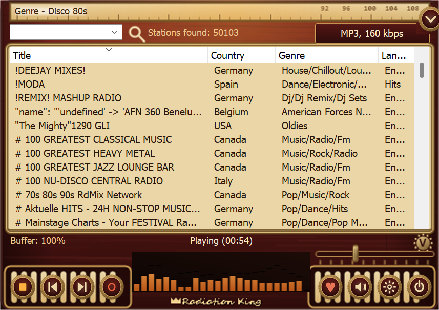

# Radiation King — a skin and a station updater for Radio? Sure!

Two things for anyone still running RadioSure in 2026:

1. **Radiation King** — a skin styled after the 1950s valve radio from Fallout.
2. **A station database updater** — a PowerShell script that rebuilds RadioSure's
   station list from the live [Radio-Browser](https://www.radio-browser.info)
   directory. About 50,000 working stations, and it can run itself weekly.

There is also **`SKIN-AND-RSD-FORMAT.md`**, which documents the `.rsd` and skin
formats properly, including a few things that do not appear to be written down
anywhere else. If you only take one thing from this package, take that file.



---

## Why

RadioSure's own server went dark in March 2022, so the built-in updater has
nothing to talk to and the shipped database has been rotting ever since. Most
people conclude the app is dead and move on. It isn't — the player still works
beautifully, it just needs a current station list.

Philiweb (GHbasicuser) solved this years ago at
[radiosure.fr](https://www.radiosure.fr) and has been quietly rebuilding the
database every single day since. This package is a second route to the same
place, plus a skin, plus notes.

---

## Getting RadioSure itself

Nothing here includes the player — you need a copy first, and TheBestware's own
site has been gone since March 2022. The last free installer is preserved here:

- **[JazzfanRS/Radiosure-station-database](https://github.com/JazzfanRS/Radiosure-station-database)**
  — `RS-2.2.1046-setup.exe`, the last known free build, alongside the final
  official 2022 station database.
- **[radiosure.fr](https://www.radiosure.fr)** — the surviving community hub,
  and the daily-rebuilt database if you would rather not run a script.

**Do not pay anyone for RadioSure.** The free build always was free, the paid
licences came from a developer who is no longer trading, and nobody else has
standing to sell it. If you find it for sale bundled with a skin pack, what you
are being offered is someone else's binary — and repackaged installers of
abandoned software are a well-worn way to deliver something you did not ask for.
Take it from the preservation repo above, where the file is public and its
history is visible.

**If you already own the paid version, leave it alone.** The paid and free lines
number *separately*, so the free `2.2.1046` is not an upgrade over a paid
`2.2.1042` — installing it replaces a licensed binary with a lesser one. Back up
your install folder before you experiment. The updater and skin in this repo work
on either build.

---

## Installing the skin

1. Copy the folder `Skin\Radiation King.rsn` into RadioSure's `Skins` folder.
   - Usually `%LOCALAPPDATA%\RadioSure\Skins`, next to `RadioSure.exe`.
2. Start RadioSure → **Options** → pick **Radiation King**.

That's it. The skin keeps the stock control layout exactly — same buttons in the
same places — so nothing about how you use the player changes.

Both window states are included: `skin.rsn` (expanded, 490×346) and `skin2.rsn`
(collapsed, 490×100).

### Recolouring it

`Skin\Build-RadiationKingSkin.ps1` generates every image in the skin from code —
there are no hand-painted assets. Change the palette block at the top and re-run
it for a different colourway. Requires nothing but Windows PowerShell.

While RadioSure is open it holds the skin PNGs, so close it before regenerating.
**Press F5 in RadioSure to reload a skin without restarting** — invaluable when
you are tweaking `skin.rsn` by hand.

---

## Installing the updater

1. Copy both files from `Updater\` into your RadioSure folder, next to
   `RadioSure.exe`.
2. Close RadioSure.
3. Double-click **`Update Stations.cmd`**. Takes about two minutes.

It downloads the current Radio-Browser directory, converts it to `.rsd`, and
installs it. Your previous database is moved to `Stations\_previous\` rather
than deleted, and `RadioSure.xml` — your favourites, history and settings — is
never written to.

### What it does to the list

- Drops HLS and video-container streams. RadioSure ships a 2013 build of BASS
  that cannot play them; they fail silently when clicked, which is worse than
  not being listed.
- Merges duplicate listings of the same station into the format's six URL slots,
  so a station with dead primary stream can fall back.
- Derives Genre from Radio-Browser tags, ranked by how commonly each tag is used
  across the whole directory, so real genres come first and one-off vanity tags
  go last.
- Puts tags, codec, bitrate and homepage in Description, which RadioSure's
  filter box searches.

### Options

```
.\Update-RadioSureStations.ps1 -DryRun              # build it, install nothing
.\Update-RadioSureStations.ps1 -MaxStations 30000   # cap to the most popular
.\Update-RadioSureStations.ps1 -BackupDir "D:\Backups\RadioSure"
.\Update-RadioSureStations.ps1 -Scheduled           # unattended mode, see below
```

`-BackupDir` copies `RadioSure.xml` somewhere safe on every successful run and
keeps the last dozen snapshots. It is empty by default; set it to a real path
and your favourites get backed up automatically. Recommended — the station list
rebuilds in two minutes, your favourites do not.

### Running it weekly by itself

`-Scheduled` mode never blocks and never nags: it writes to `update-log.txt`,
skips if the database is under six days old, and **defers if RadioSure is
running** rather than failing. So a task that fires repeatedly through the day
will quietly catch a moment when the player is closed.

To register it (no admin rights needed — adjust the path):

```powershell
$rs = "$env:LOCALAPPDATA\RadioSure"
$action = New-ScheduledTaskAction -Execute "powershell.exe" `
  -Argument "-NoProfile -ExecutionPolicy Bypass -WindowStyle Hidden -File `"$rs\Update-RadioSureStations.ps1`" -Scheduled" `
  -WorkingDirectory $rs
$trigger = New-ScheduledTaskTrigger -Weekly -DaysOfWeek Sunday -At 9am
$rep = (New-ScheduledTaskTrigger -Once -At (Get-Date) `
  -RepetitionInterval (New-TimeSpan -Hours 2) `
  -RepetitionDuration (New-TimeSpan -Hours 12)).Repetition
$trigger.Repetition = $rep
$settings = New-ScheduledTaskSettingsSet -StartWhenAvailable -MultipleInstances IgnoreNew
Register-ScheduledTask -TaskName "RadioSure Station Update" `
  -Action $action -Trigger $trigger -Settings $settings -Force
```

### If it fails

It is deliberately cautious: if the download is short, or Radio-Browser is
throttling, it aborts and leaves your existing list alone. Radio-Browser answers
bulk requests with a `503` when hit repeatedly — the script backs off and
retries, so just run it again later.

---

## Requirements

Windows PowerShell 5.1 (already on every Windows 10/11 box) and an internet
connection. No installs, no modules, no dependencies.

---

## Credits and licence

- **Radio? Sure!** by TheBestware Studio. Development ceased; the original site
  went offline in March 2022.
- **[radiosure.fr](https://www.radiosure.fr)** and the RB2RS converter by
  **Philiweb / GHbasicuser**, who has kept this app supplied with stations since
  2022. If you use RadioSure at all, you are standing on his work.
- **[Radio-Browser](https://www.radio-browser.info)** — the community station
  directory this pulls from. Free, open, checks every stream every 24 hours.
  Consider contributing corrections there; it helps everyone downstream.
- **[JazzfanRS/Radiosure-station-database](https://github.com/JazzfanRS/Radiosure-station-database)**
  preserves the final official 2022 database and installer.
- **Fallout**, **Vault-Tec** and the Radiation King are trademarks of **Bethesda
  Softworks**. This skin is unofficial fan work, made with respect and no
  affiliation. Every pixel is drawn from scratch in code — no game assets are
  used or redistributed.

The skin artwork and the scripts are free to use, modify and share. A credit is
appreciated but not required. If you make a nicer colourway, please post it —
that is the whole point.
