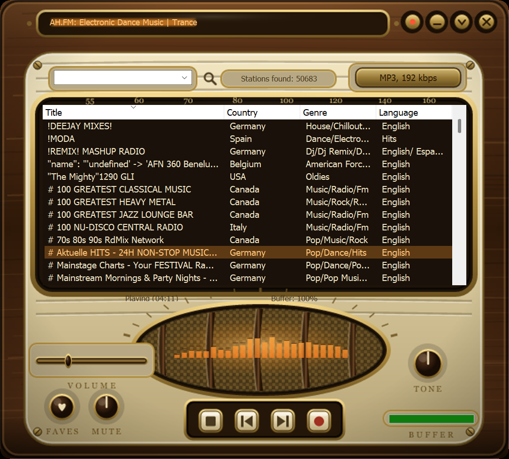
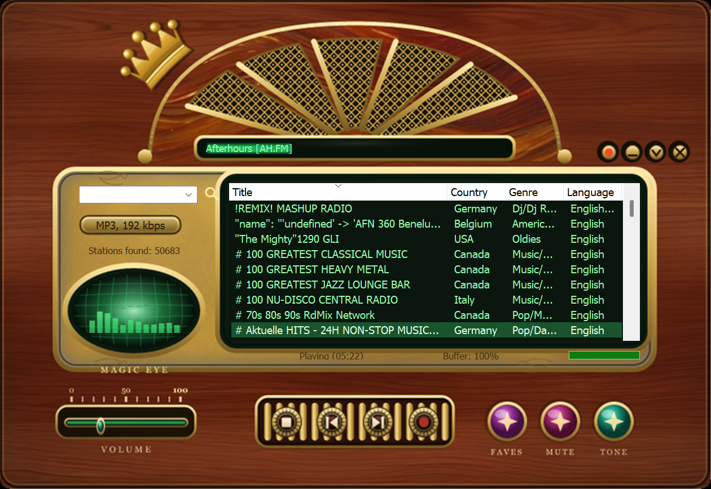
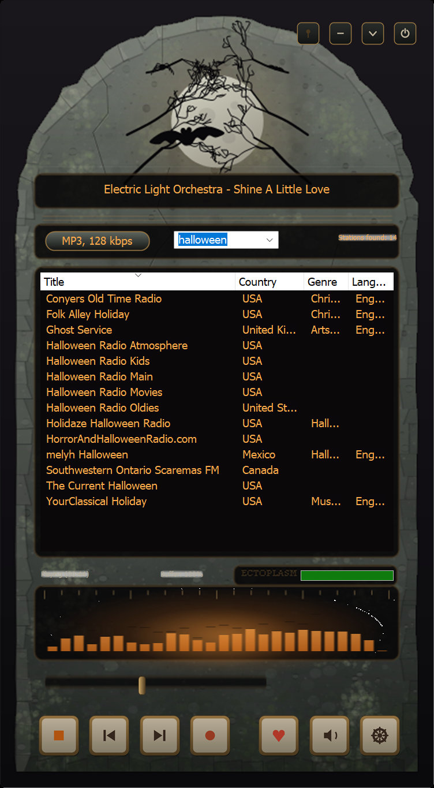
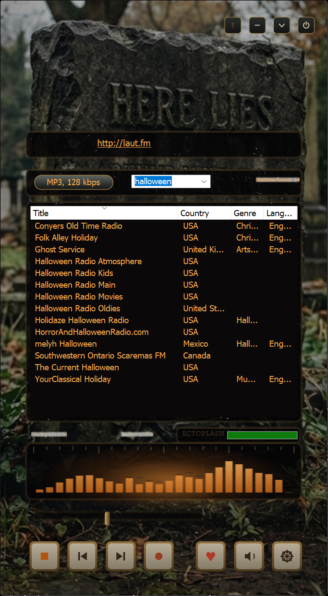
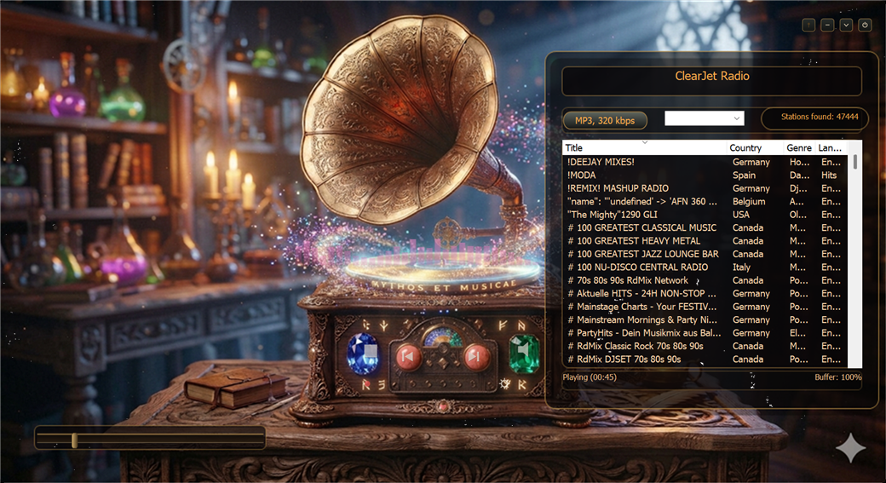
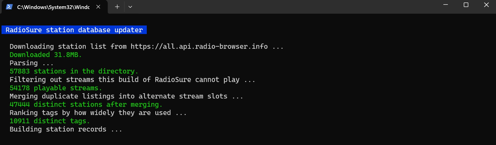

# Radiation King — skins and a station updater for Radio? Sure!

Two things for anyone still running RadioSure in 2026:

1. **Six skins** — three styled after the 1950s valve radio from Fallout, two
   upright ones cut as a headstone, and a wizard's gramophone.
2. **A station database updater** — a PowerShell script that rebuilds RadioSure's
   station list from the live [Radio-Browser](https://www.radio-browser.info)
   directory. About 50,000 working stations, and it can run itself weekly.

There is also **`SKIN-AND-RSD-FORMAT.md`**, which documents the `.rsd` and skin
formats properly, including a few things that do not appear to be written down
anywhere else. If you only take one thing from this package, take that file.


---

## Why

RadioSure's own server went dark in March 2022, so the built-in updater has
nothing to talk to and the shipped database has been rotting ever since. Most
people conclude the app is dead and move on. It isn't — the player still works
beautifully, it just needs a current station list.

Philiweb (GHbasicuser) solved this years ago at
[radiosure.fr](https://www.radiosure.fr) and has been quietly rebuilding the
database every single day since. This package is a second route to the same
place, plus a skin, plus notes.

---

## Getting RadioSure itself

Nothing here includes the player — you need a copy first, and TheBestware's own
site has been gone since March 2022. The last free installer is preserved here:

- **[JazzfanRS/Radiosure-station-database](https://github.com/JazzfanRS/Radiosure-station-database)**
  — `RS-2.2.1046-setup.exe`, the last known free build, alongside the final
  official 2022 station database.
- **[radiosure.fr](https://www.radiosure.fr)** — the surviving community hub,
  and the daily-rebuilt database if you would rather not run a script.

**Do not pay anyone for RadioSure.** It is being sold — typically as a skin pack
with the player bundled in, a dozen colourful skins and a copy of the app. That
copy is not theirs to give. The free build always was free, the paid licences
came from a developer no longer trading, and nobody has acquired the right to
resell either. What you would actually be buying is a repackaged installer of
abandoned software from a stranger, which is a well-worn way to deliver
something you did not ask for. Take the player from the preservation repo above,
where the file is public and its history is visible, and take skins from people
who give them away.

**If you already own the paid version, leave it alone.** The paid and free lines
number *separately*, so the free `2.2.1046` is not an upgrade over a paid
`2.2.1042` — installing it replaces a licensed binary with a lesser one. Back up
your install folder before you experiment. The updater and skin in this repo work
on either build.

---

## The skins

| Skin | Size | Notes |
|---|---|---|
| **Radiation King** | 490×346 | Stock control layout — same buttons in the same places, restyled. Generated entirely from `Build-RadiationKingSkin.ps1`. |
| **Radiation King Cabinet** | 620×560 | Cream and wood tabletop set. Oval woven grille, engraved control labels, and a Minimize button the other two do not have. |
| **Radiation King Deluxe** | 720×496 | Mahogany and brass. Gold sunburst grille, and the spectrum analyser lives inside a green magic-eye tube. |
| **Hallows Eve** | 366×663 | The odd one out: a **vertical** player, cut as a weathered granite headstone. Generated entirely from `Build-HallowsEveSkin.ps1`. |
| **Hallows Eve Photo** | 366×663 | The same layout over a photographic headstone instead of a drawn one. Same generator, run with `-Photo`. |
| **High Contrast** | 600×360 | Not illustration — an accessible skin. Yellow on black at 19.6:1, hard edges, and controls that inverse completely on hover instead of glowing. Deliberately the smallest skin here. |
| **Gramophone** | 1040×567 | A wizard's study. The cabinet's own carvings are the controls — the jewels, the cabochons and the runes are the buttons, and the spectrum drifts in the stardust above the record. |

Every skin includes both the expanded and the collapsed window state. As with
the other skins, some things in the artwork are left for you to find rather
than listed here.

The photo skin's source image doubles as a matching wallpaper:
`Skins\source\hallows-eve-headstone.png`.











## Accessibility

**High Contrast** is the odd one out in this repo. The other six are
illustration; this one has a job, and every choice in it is a constraint rather
than a preference.

- **Yellow on black, measured at 19.6:1.** WCAG asks 4.5:1 for AA and 7:1 for
  AAA on normal text. The list is white on black at 21:1, and selection inverts
  to black on yellow. Yellow-on-black is also the scheme low-vision users
  already know from Windows' own High Contrast Black theme.
- **Hard edges, no antialiasing on rules.** Antialiasing paints a 50% fringe on
  both sides of a border — a 3px yellow rule measured 128,128,0 at its edges,
  which drops that edge to 5.0:1. Every border here is drawn with smoothing off
  so it stays at full contrast.
- **State changes by inversion, not glow.** Hovering a button swaps foreground
  and background completely. A subtle highlight is invisible to the people this
  is for.
- **It is the smallest skin here on purpose.** RadioSure is not DPI-aware, so
  Windows hands it a virtual screen of resolution ÷ scaling — and high scaling,
  which is what this audience runs, *shrinks* that screen. At 1080p and 250%
  the usable height is only 384px. At 600×360 this fits; a larger skin would
  fail for the people who most need it.

### Two things a skin cannot do

**It cannot enlarge the station list.** Only five elements accept `TextSize` —
the now-playing line, status, buffer, found-count and song title. `List` and the
filter box use the Windows font, so the skin controls their colour but not their
size. Larger list text comes from Windows' own display scaling.

**It cannot help with voice control.** Skins draw pixels; they do not create
accessible objects. RadioSure's buttons are custom-drawn images with nothing
behind them for UI Automation to find, which is why Windows Voice Access will
not locate them by name. The working route is **global hotkeys**, which
RadioSure supports and enables by default — Voice Access custom commands can
send keystrokes, which bypasses the interface entirely.

For screen-reader users there is an actively maintained NVDA add-on for
RadioSure at
[paulber19/radioSureAccessEnhancementNVDAAddon](https://github.com/paulber19/radioSureAccessEnhancementNVDAAddon).
It is unrelated to this repo and solves a different problem — speaking the
interface, rather than making it visible.

## Installing a skin

1. Copy the whole `<Name>.rsn` folder out of `Skins\` into RadioSure's own
   `Skins` folder — the one **next to `RadioSure.exe`**.
   - RadioSure is portable. It keeps `RadioSure.xml` beside the executable, not
     in the registry and not under `AppData`. So if the player lives in
     `D:\RadioSure\`, the skins go in `D:\RadioSure\Skins\`. On most installs
     there is no `%LOCALAPPDATA%\RadioSure` folder at all — don't go looking for
     one.
2. Start RadioSure → **Options** → pick the skin by name.
   - Use Options, not F5. F5 reloads the images, but the window's corner shaping
     is only applied when a skin is *loaded*, so F5 leaves new artwork in the old
     window shape.

That's it. Nothing about how you use the player changes.

### What "complete" means for a skin

Plenty of skins in circulation — including ones people charge for — look
handsome in a screenshot and are unfinished underneath. A screenshot only ever
shows one window state, so it cannot show you what is missing. Worth checking
before you install one, and worth checking in this one:

- **Is `skin2.rsn` there?** Without it the collapsed window falls back to the
  stock layout, so shrinking the player throws away the artwork.
- **Are all three button states drawn?** `X.png`, `X-hot.png`, `X-pressed.png`,
  plus the `-2` variants for toggles like Play/Stop, Mute, Rec and OnTop. Miss
  the toggle variants and the button stops telling you what state it is in.
- **Do the readouts sit on the artwork, or on grey plates?** A `<BkColor>` with
  alpha 0 makes a label transparent; without it every text field paints an
  opaque system-coloured rectangle over the design.
- **Is the spectrum well clean?** `<GlassLevel>` must be `0` on `<Spectrum>` or a
  pale sheen is painted over the top of it, which reads as a grey box.

All four are documented, with the reasoning, in
[`SKIN-AND-RSD-FORMAT.md`](SKIN-AND-RSD-FORMAT.md). None of it appears to be
written down anywhere else, which is probably why so many skins get it wrong.

### Recolouring it

`Skins\Build-RadiationKingSkin.ps1` and `Skins\Build-HallowsEveSkin.ps1`
generate every image in their skins from code — there are no hand-painted
assets. Each has a palette block at the top and a layout table below it; change
either and re-run. Requires nothing but Windows PowerShell. The Cabinet and
Deluxe skins are drawn the same way, from their own generators; those two
scripts are not in the repo yet.

The Hallows Eve generator also builds the photographic variant, from the same
layout table, if you give it an image:

```powershell
.\Build-HallowsEveSkin.ps1 -SkinName "Hallows Eve Photo" `
    -Photo ".\source\hallows-eve-headstone.png" -PhotoNight 0.28
```

`-PhotoCentre` slides the crop across the source, and `-PhotoNight` sets how far
it is graded toward night — 0 leaves the photo untouched, 1 is black. The crop
is always taken at the window's aspect ratio and never squashed to fit, and the
collapsed strip is cropped at the same magnification as the expanded face so the
two states show the same stone at the same scale. Point it at a photograph of
your own and you get a different skin from the same code.

While RadioSure is open it holds the skin PNGs, so close it before regenerating.
**Press F5 in RadioSure to reload a skin without restarting** — invaluable when
you are tweaking `skin.rsn` by hand.

---

## Installing the updater

1. Copy both files from `Updater\` into your RadioSure folder, next to
   `RadioSure.exe`.
2. Close RadioSure.
3. Double-click **`Update Stations.cmd`**. Takes about two minutes.



It downloads the current Radio-Browser directory, converts it to `.rsd`, and
installs it. Your previous database is moved to `Stations\_previous\` rather
than deleted, and `RadioSure.xml` — your favourites, history and settings — is
never written to.

That is the run going well. What the picture cannot show is the part that
matters most on a bad day: Radio-Browser throttles bulk requests, and when it
answers with a `502` or `503` the script tries the next mirror, then backs off
15, 45 and 90 seconds before trying again, rather than falling over or — worse —
installing a half-downloaded list. It does not match on a status code at all: any
failed mirror, timeout included, takes the same path.

### What it does to the list

- Drops HLS and video-container streams. RadioSure ships a 2013 build of BASS
  that cannot play them; they fail silently when clicked, which is worse than
  not being listed.
- Merges duplicate listings of the same station into the format's six URL slots,
  so a station with dead primary stream can fall back.
- Derives Genre from Radio-Browser tags, ranked by how commonly each tag is used
  across the whole directory, so real genres come first and one-off vanity tags
  go last.
- Puts tags, codec, bitrate and homepage in Description, which RadioSure's
  filter box searches.

### Options

```
.\Update-RadioSureStations.ps1 -DryRun              # build it, install nothing
.\Update-RadioSureStations.ps1 -MaxStations 30000   # cap to the most popular
.\Update-RadioSureStations.ps1 -BackupDir "D:\Backups\RadioSure"
.\Update-RadioSureStations.ps1 -Scheduled           # unattended mode, see below
```

`-BackupDir` copies `RadioSure.xml` somewhere safe on every successful run and
keeps the last dozen snapshots. It is empty by default; set it to a real path
and your favourites get backed up automatically. Recommended — the station list
rebuilds in two minutes, your favourites do not.

### Running it weekly by itself

`-Scheduled` mode never blocks and never nags: it writes to `update-log.txt`,
skips if the database is under six days old, and **defers if RadioSure is
running** rather than failing. So a task that fires repeatedly through the day
will quietly catch a moment when the player is closed.

To register it (no admin rights needed — adjust the path):

```powershell
$rs = "D:\RadioSure"        # the folder RadioSure.exe is in
$action = New-ScheduledTaskAction -Execute "powershell.exe" `
  -Argument "-NoProfile -ExecutionPolicy Bypass -WindowStyle Hidden -File `"$rs\Update-RadioSureStations.ps1`" -Scheduled" `
  -WorkingDirectory $rs
$trigger = New-ScheduledTaskTrigger -Weekly -DaysOfWeek Sunday -At 9am
$rep = (New-ScheduledTaskTrigger -Once -At (Get-Date) `
  -RepetitionInterval (New-TimeSpan -Hours 2) `
  -RepetitionDuration (New-TimeSpan -Hours 12)).Repetition
$trigger.Repetition = $rep
$settings = New-ScheduledTaskSettingsSet -StartWhenAvailable -MultipleInstances IgnoreNew
Register-ScheduledTask -TaskName "RadioSure Station Update" `
  -Action $action -Trigger $trigger -Settings $settings -Force
```

### If it fails

It is deliberately cautious: if the download is short, or Radio-Browser is
throttling, it aborts and leaves your existing list alone. Radio-Browser answers
bulk requests with a `502` or `503` when hit repeatedly — the script tries the
other mirrors, then backs off and retries, so just run it again later.

### Read the log before you theorise

Every run appends to **`update-log.txt`**, next to `RadioSure.exe`. Timestamps,
station counts at each stage, and the exact text of any error — including the
runs that failed and retried, which are the ones worth having.

```
2026-08-02 09:57:02  WARN: Mirror failed: The remote server returned an error: (503) Server Unavailable.
2026-08-02 09:57:02  WARN: Waiting 15 seconds before retrying (the server throttles bulk downloads) ...
2026-08-02 10:00:46  Done. 50103 stations installed. Start RadioSure.
```

This is not decoration. The sentence above about `502` and `503` was wrong for
months — it named only the `503` — and the log is what corrected it: seven runs,
three of each, evenly split. If something looks off, read the log before
believing anyone's memory of it, including your own.

Unattended runs write there too, so a task that fired at 9am while you were
asleep still leaves you the whole story.

---

## Requirements

Windows PowerShell 5.1 (already on every Windows 10/11 box) and an internet
connection. No installs, no modules, no dependencies.

---

## Credits and licence

- **Radio? Sure!** by TheBestware Studio. Development ceased; the original site
  went offline in March 2022.
- **[radiosure.fr](https://www.radiosure.fr)** and the RB2RS converter by
  **Philiweb / GHbasicuser**, who has kept this app supplied with stations since
  2022. If you use RadioSure at all, you are standing on his work.
- **[Radio-Browser](https://www.radio-browser.info)** — the community station
  directory this pulls from. Free, open, checks every stream every 24 hours.
  Consider contributing corrections there; it helps everyone downstream.
- **[JazzfanRS/Radiosure-station-database](https://github.com/JazzfanRS/Radiosure-station-database)**
  preserves the final official 2022 database and installer.
- **Fallout**, **Vault-Tec** and the Radiation King are trademarks of **Bethesda
  Softworks**. These skins are unofficial fan work, made with respect and no
  affiliation. No game assets are used or redistributed.
- **How the artwork is made.** Four of the six skins are drawn entirely in code
  — every gradient, knob, grille and speck of grit is a `System.Drawing` call in
  a PowerShell script, with no photographs, no clip art and no hand-painted
  files. **Hallows Eve Photo** and **Gramophone** are the exceptions: their
  backgrounds are rendered images, and both source files ship in
  `Skins\source\`. Everything laid over those backgrounds — plates, wells,
  keys, sliders, spectrum — is drawn in code like the rest. Hallows Eve Photo
  can be rebuilt end to end from its generator; the Gramophone's layout was
  placed by hand against its render, so it has no generator here.
- **The rendered backgrounds** — the headstone in Hallows Eve Photo, and the
  gramophone — were generated with
  **Nano Banana**, Google's image model, from text prompts written by the author.
  It is not a photograph of a real grave, not stock imagery, and not anyone
  else's work — the image was rendered to order for this skin, and the prompt
  behind it is the author's own. The name and dates carved into it are invented.
  Everything laid over that background — the plates, the wells, the keys, the
  spectrum — is drawn in code like the rest.

The skin artwork and the scripts are free to use, modify and share. A credit is
appreciated but not required. If you make a nicer colourway, please post it —
that is the whole point.
